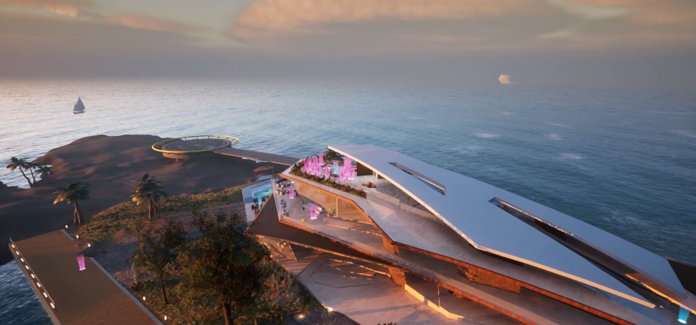

# 🏝️ NEOM Sindalah Island – Digital Twin

A **digital twin of NEOM Sindalah Island** was created in **Unreal Engine**, designed with **3D accuracy** to replicate the **physical island and its luxury infrastructure**.  

This platform allows **tourists to virtually explore Sindalah**, interact with **digital surrogates**, and bridge the gap between **physical tourism and digital experiences**.  

What if travelers could **walk through Sindalah’s marinas, hotels, and beaches virtually** before ever setting foot on the island?  
What if their **digital journeys rewarded them with real perks**, making the virtual experience a **seamless extension of their physical visit**?  

This project combines **BIM-to-3D workflows**, **Unreal Engine environment design**, and **interactive features** to create a **globally accessible tourism twin**.  

---

[▶ Watch Demo Video](https://drive.google.com/file/d/14h7diuuF-C5axfG8dnxDkXL-FdqBvVIE/view?usp=drive_link)

---

## 📑 Contents
- [🔄 Workflow Summary](#-workflow-summary)  
- [🎨 Custom 3D Assets](#-custom-3d-assets)  
- [🏞️ Environment Design](#-environment-design)  
- [🎮 Interactive Features](#-interactive-features)  
- [🖥️ UI & Controls](#-ui--controls)  
- [🧪 Deployment](#-deployment)  
- [✨ Core Highlights](#-core-highlights)  
- [🔐 Data Privacy & Security](#-data-privacy--security)  

---

## 🔄 Workflow Summary

### 📂 Data Preparation
- Imported **BIM models** of Sindalah Island structures  
- Optimized geometry using **Blender/Substance workflows** for Unreal compatibility  

### 🛠️ Unreal Engine Setup
- Initialized project using **Third Person Template** with **GIS, Water, and Environment Design plugins**  
- Configured the **base island environment** for real-time 3D exploration  

---

## 🎨 Custom 3D Assets
- Built **designer furniture, décor, and hospitality props** for hotels, restaurants, lounges, and recreation zones  
- Populated exteriors with **poolside setups, leisure furniture, and public amenities**  

---

## 🏞️ Environment Design
- Added **foliage** for landscaping and immersive island greenery  
- Integrated **Oceanology Plugin** for realistic seawater  
- Applied **Water Plugin** for pools and lagoons  
- Placed **cruise ships and boats** around the marina to highlight Sindalah’s **tourism hub identity**  

---

## 🎮 Interactive Features
- Implemented **portal-based teleportation** for smooth navigation across hotels, beach clubs, marinas, and pools  
- Added **digital avatars (surrogates)** for interactive tourist experiences  
- Built a **reward system** where users earn points during exploration and redeem them for **real-world perks**  

---

## 🖥️ UI & Controls
Developed a **Blueprint-driven UI** with features for:  
- Area selection & quick teleportation  
- Viewing hotel layouts or land parcels  
- Tracking earned reward points  

---

## 🧪 Deployment
- Packaged as a **cross-platform real-time 3D visualization**  
- Enabled via **Pixel Streaming** for seamless access across global devices  

---

## ✨ Core Highlights
- Digital twin creation with **architectural 3D accuracy**  
- Virtual exploration of **luxury tourism island experiences**  
- **Reward system** connecting virtual achievements to real-world perks  
- **BIM-to-3D visualization pipeline**  
- Built with **Unreal Engine + Blender/Substance**  

---

## 🔐 Data Privacy & Security
Our **data handling approach** prioritizes **client data sovereignty** through:  
- **On-premises deployment**  
- **Comprehensive security controls**  
- **Transparent operational practices**  

All solutions operate **within client infrastructure**, ensuring:  
- Complete **data ownership and control**  
- Maintenance of **enterprise-grade security standards** throughout the **project lifecycle**  

---
